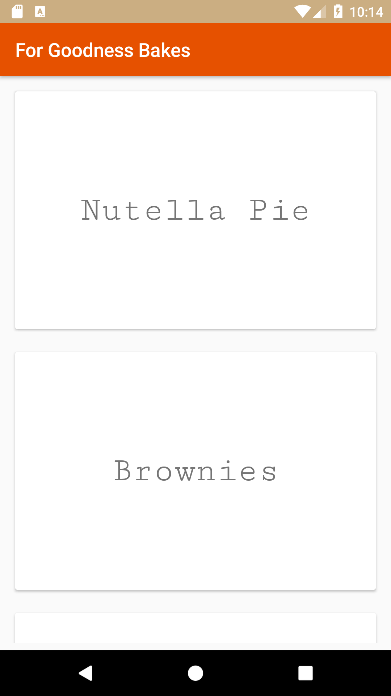
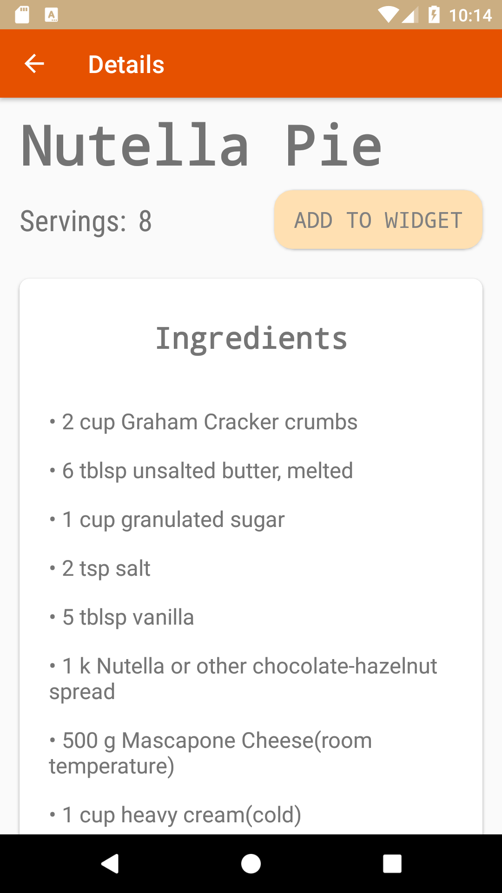
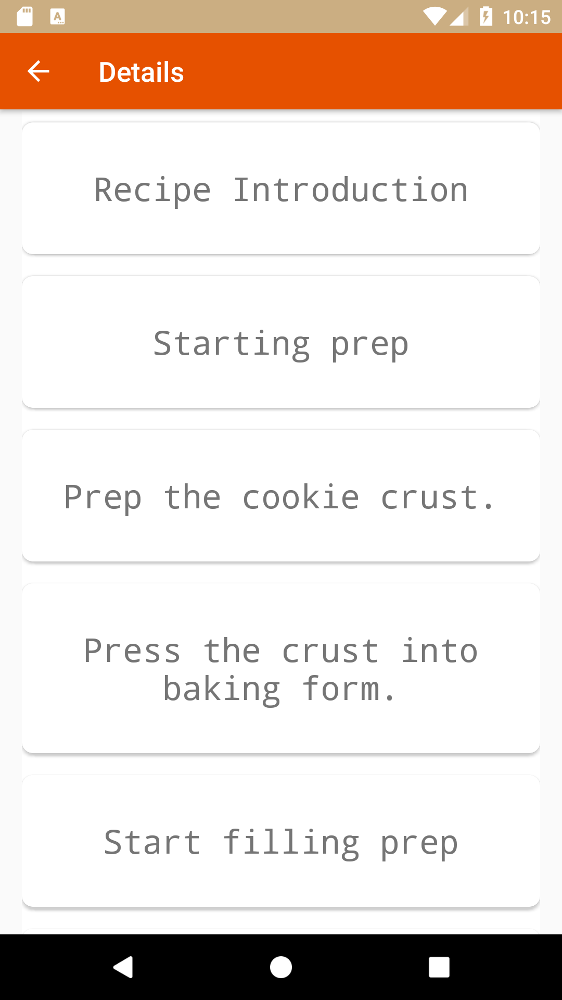
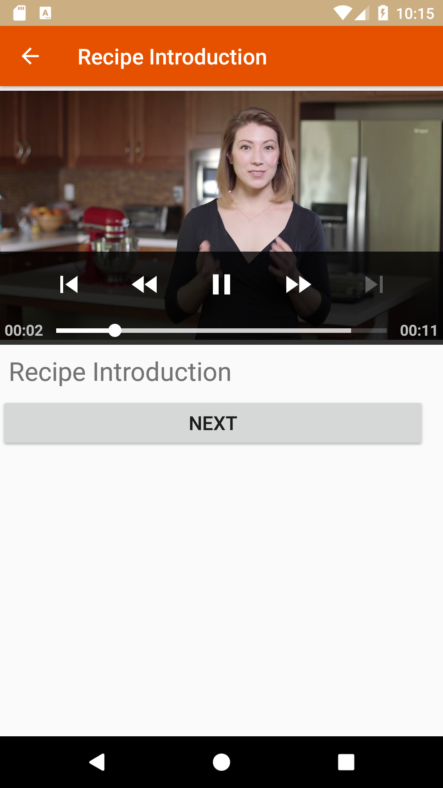
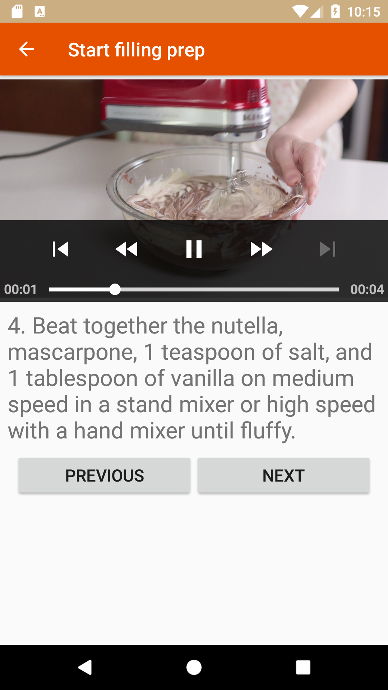
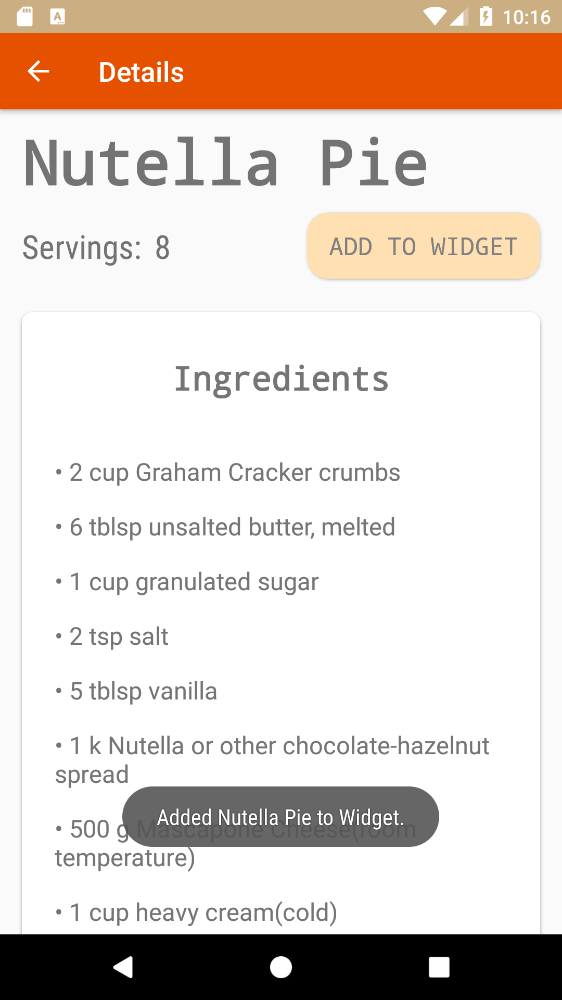
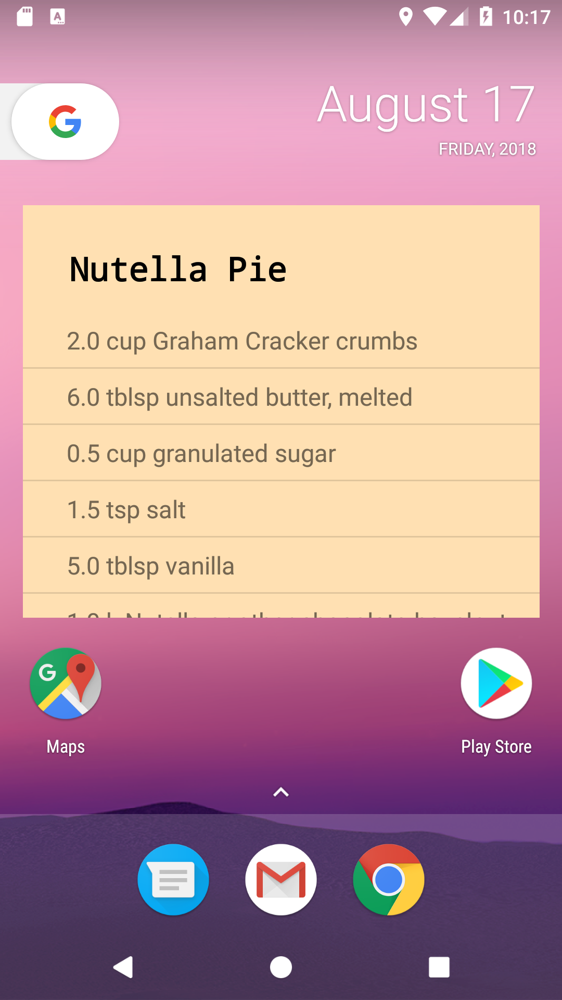
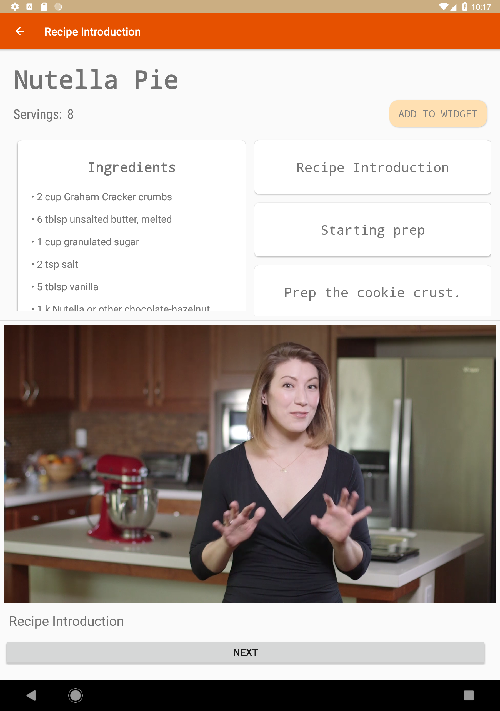
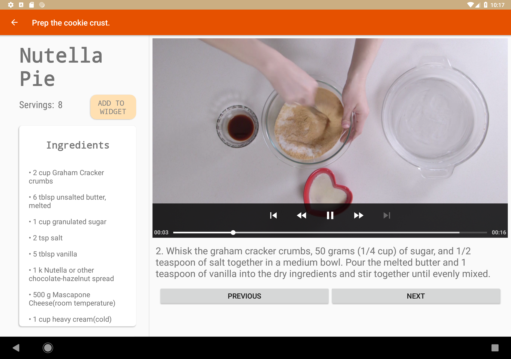

# Baking Recipe Android App

## Overview
This project is apart of the Udacity Android Developer Nanodegree. In this project (stage 2 of 2), we were prompted to build a responsive app that allows users to select a recipe and see video-guided steps for how to complete it. 

The recipe listing json file is located [here](https://d17h27t6h515a5.cloudfront.net/topher/2017/May/59121517_baking/baking.json).

## Concepts this Project Encompasses
- Exoplayer to display videos for the step instructions
- Handling error cases in Android
- Creating and adding a widget to the app experience
- Implementing [Butterknife](http://jakewharton.github.io/butterknife/), a third-party library used in the app for reducing view injection code
- Responsive Phone and Tablet UI design (with the help of Fragments)
- Json parsing, AsyncTask, RecyclerViews

## Screenshots
### App Initialization
&nbsp;&nbsp;
&nbsp;&nbsp;
&nbsp;&nbsp;
### Instruction/Step Detail View

&nbsp;&nbsp;
&nbsp;&nbsp;
### Adding a Widget

&nbsp;&nbsp;
&nbsp;&nbsp;
### Tablet Landscape & Portrait Views

&nbsp;&nbsp;
&nbsp;&nbsp;
